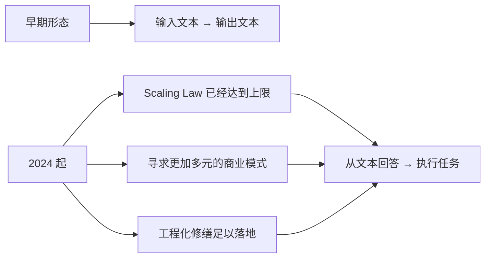
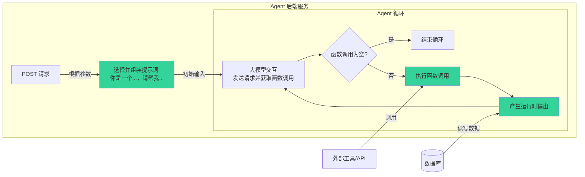
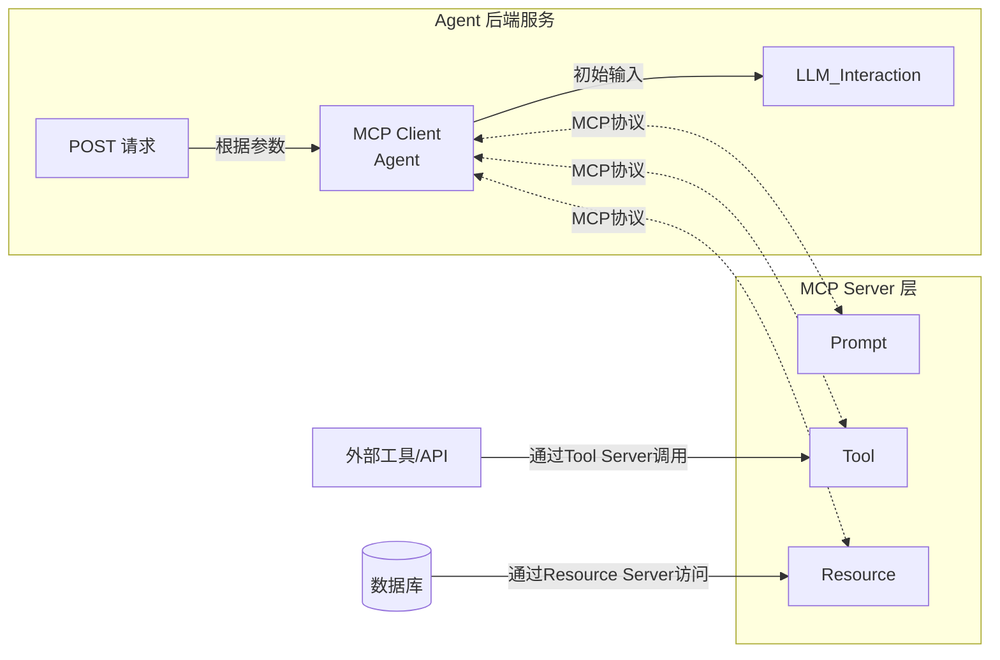
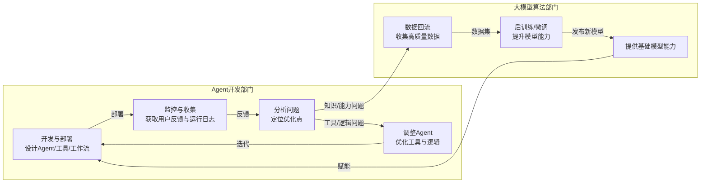

## Sec.1 从大模型到 AI Agent

这里假设大家都有一定的技术基础所以我就长话短说了。

### 2015 - 2021 技术积累阶段

- NVIDIA CUDA 生态 & NVLink 技术（2014年提出，2016 年商用）

- Transformer 提出（2017 年提出，2019年代码接口统一化，2021年生态完善）

- DeepSpeed 大模型训练框架（2020 年开源，关键优化技术 2021 年完成）

- 互联网积累的大规模语料

  

### 2020 - 2023 大规模验证时期

- 2020年：GPT-3，堆参数可以让智能不断提升，奠定了目前所有模型的架构范式。
- 2022年：InstructGPT，首次提出 RLHF，奠定了目前所有大模型的训练范式。
- 2022年：ChatGPT 爆火。
- 2023 - 2024：百模大战，gemini，文心一言，deepseek，qwen，kimi，claude，grok …


### 2024 - 至今 迈向 Agent 时代




## Sec.2 MCP 的由来和原理

为了让大模型可以执行任务，function calling 的概念被提出并加以工程化实现。在接口层面，目前所有的 function calling 均通过 openai 协议进行约束和调用。

受限于时间的关系此处我并不会讲解function calling的实现原理，如果大家感兴趣的话可以去查看我过往的两篇博客。

https://kirigaya.cn/blog/article?seq=325

https://kirigaya.cn/blog/article?seq=345


### function calling 案例

一个最简单的function calling的案例如下在这个案例中我们让大模型学会调用查询天气的函数。

```python
from openai import OpenAI
client = OpenAI(api_key="your_api_key")

# 定义函数
def get_weather(city: str):
    return {"北京": "28°C", "上海": "30°C"}.get(city, "未知")

# 函数 schema
functions = [{
    "name": "get_weather",
    "parameters": {
        "type": "object",
        "properties": {"city": {"type": "string"}},
        "required": ["city"]
    }
}]

# 用户提问
resp = client.chat.completions.create(
    model="gpt-4o-mini",
    messages=[{"role": "user", "content": "北京天气怎么样？"}],
    functions=functions,
    function_call="auto"
)

# 执行并返回结果
args = eval(resp.choices[0].message.function_call.arguments)
result = get_weather(**args)
print("最终回答:", result)
```

试想一下随着业务规模的不断扩大我们在业务中所需要让大模型能够转入的函数也会越来越多可能会有五十个或者九十个并且我们引导大模型来解决问题的引导提示词也会越来越庞杂那么试想一下倘若那个时候function calling的代码会有多长呢？

当然为了解决这个问题各种各样形形色色的agent框架也被提了出来，但其实其中的大部分都并没有对这个问题从软件工程的角度来进行一次完美的抽象。


### 鱼龙混杂的不便

随着业务的不断增加我们在后端代码中嵌入了如上进行function calling的代码而当function calling本身所涉及到的agent有所变化那么整个后端就需要完全重写而且随着业务的不断扩大如上的一套进行function calling代码只会越拉越大导致项目的维护性直线下降一线开发agent的工程师经常苦不堪言因为整个系统和传统软件开发相比整个系统时时刻刻都在面临无法预测的不确定性。

因此从传统软件工程的角度来说为了降低开发的心智负担我们有必要对当前的agent业务进行一定层面上的逻辑抽象我们不妨回顾一下刚才的这样的一个例子通过多次实践不难发现我们可以将上述的agent的例子抽象出如下的几个重要元素

`get_weather`: 工具

`"北京天气怎么样？"`：提词

运行时记忆（比如说终端信息）：资源

如果我们可以将这些重要的元素封装起来那么我们就可以实现Azure的开发和后端开发这两侧的完全解耦合当我们需要修改agent本身的算法时我们只需要修改agent一次后而不需要重启后端这就是解耦合的好处

### MCP 的提出

而为了实现这样的解耦合我们将这三个元素抽离了出来，并且为了让后端可以无缝的衔接来访问这些元素我们有必要规定一种特殊的协议因此用于统一化的访问这3种基本元素的协议就被我们称之为了大模型上下文协议MCP而本身实现了这3种元素的程序就被我们称为了MCP服务器。

这便是为什么 Anthropic 公司需要在2024年的十一月份提出MCP协议。 MCP协议的提出本身就是为了解决agent在开发过程中过于紧耦合的问题，用于将整个agent开发结果合成不同的模块从而降低开发的心智负担并且通过后续的研发来让各个环节逐一可控。


无 MCP 协议：耦合度高，开发和维护成本大




有 MCP 协议：后端服务与 Agent 解耦，扩展灵活




## Sec.3 OpenMCP 开发最简案例

### 配置清单

- 最新版本 vscode
- OpenMCP 插件
- python 运行时，3.10 +
- 大模型的 API token，本文使用 deepseek v3

### 案例：Word MCP

一个可以操作 word 文档的 mcp 服务器。

### STEP 1. 确定需求 & 快速开发

根据对大模型能力边界和知识边界的了解估算需要输入的 prompt

```
我现在要开发一个 MCP 服务器让大模型学会调用工具，请使用 fastmcp 设计一个 word 文档的 MCP，使得大模型可以操控 word 文件，下面是一个 MCP 的开发案例
```

> 如果公司已有业务服务，只需要在业务服务选择 endpoint，加上一圈 mcp 注解/装饰器 即可，让原本的业务服务本身也变成一个 mcp 服务器即可，不一定需要完全另外再开发一个 mcp 服务器。


### STEP 2. 验证 MCP 工具


### STEP 3. 通过交互测试评估当前 MCP


### STEP 4. 测试无误后，封装 prompt


### STEP 5. 部署 MCP 服务器


## Sec.4 MCP 与 AI Agent 的未来

### Agent 全生命周期

通过上文的了解和实践，大家不难看出，为了更加系统科学的进行Agent开发，我们很有必要建模 **Agent 的全生命周期**，从而降低我们迭代复杂系统的心智负担，并让各个环节可控，可验证，可迭代。




### 亟待解决的问题

复杂场景下：

- 如何验证真实业务场景下的结果？
- 如何通过验证的反馈去迭代系统？
- 如何将这些步骤进行标准化和统一？

> 这些都是 Agent 工程领域可以做的东西


