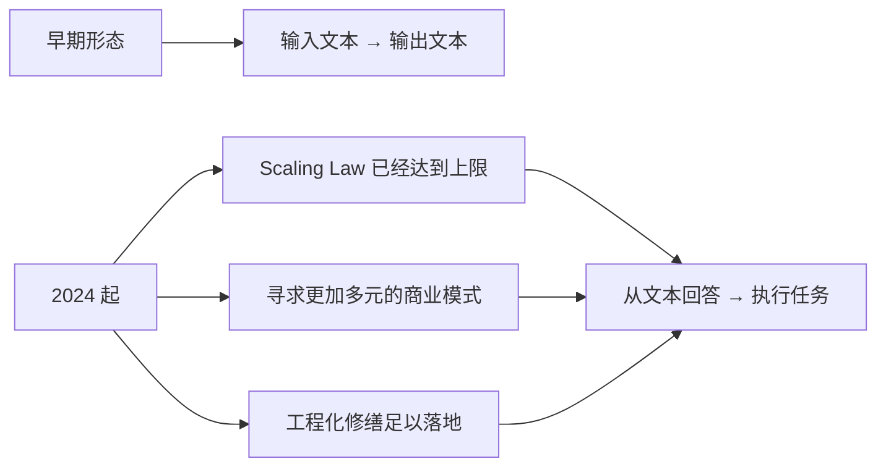
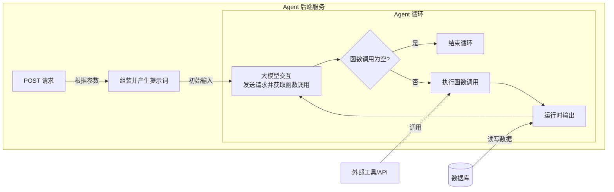
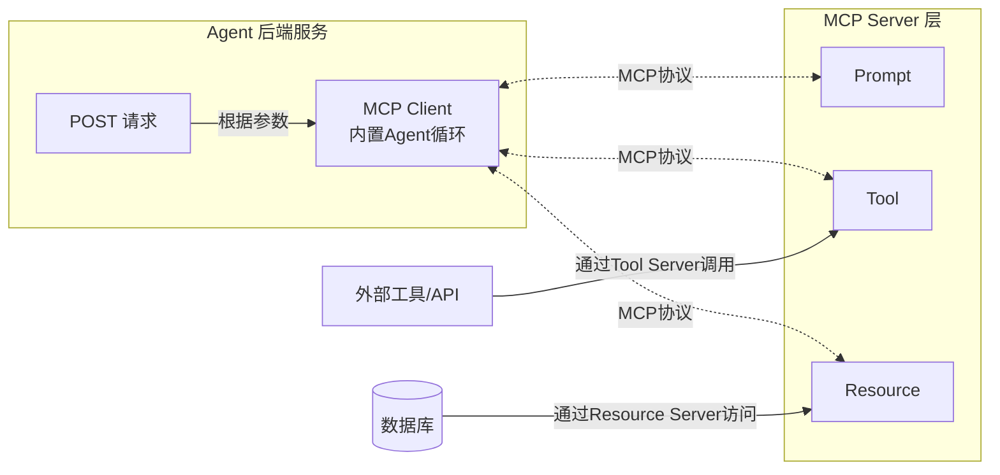
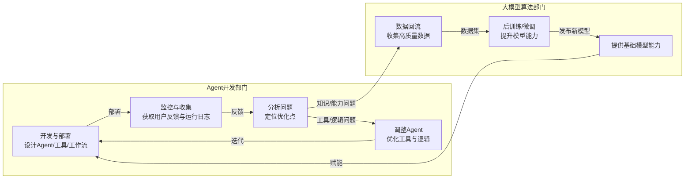

# MCP原理与最简实践
主讲人：锦恢


<div class="pt-12">
  <span @click="next" class="px-2 p-1 rounded cursor-pointer hover:bg-white hover:bg-opacity-10">
    Press Space for next page <carbon:arrow-right class="inline"/>
  </span>
</div>

---
layout: presenter
presenterImage: 'https://pic1.zhimg.com/80/v2-9a0b6e0ee617ae4e12ef22c628ff8451_1440w.png'
---

# 锦恢（黄哲龙）

- 我是 [**OpenMCP**](https://github.com/LSTM-Kirigaya/openmcp-client) 和 [**SlidevAI**](https://github.com/LSTM-Kirigaya/slidev-ai) 等的作者。
- 知乎科技领域的知势榜博主，发表技术博客累计 300 多篇。多篇博客被大学讲义和自媒体引用。
- 深度参与国内第一个大模型训练框架 **ColossalAI** 的开发。
- 今年秋招以硕士身份拿下国内某大厂人才计划。
- 欢迎在 [**知乎**](https://www.zhihu.com/people/can-meng-zhong-de-che-xian), [**B站**](https://space.bilibili.com/434469188?spm_id_from=333.1007.0.0) 和 [**我的个人网站**](https://kirigaya.cn) 关注我。

---
layout: two-cols
---


# 在那之前，我们需要 ...

### 安装 uv

```bash
pip install uv
```

### 安装 OpenMCP

```bash
在 vscode 插件商城搜索 OpenMCP 并点击安装。
```

<br>

> 本网页幻灯片由 [SlidevAI](https://github.com/LSTM-Kirigaya/slidev-ai) 制作。

::right::

1. [从大模型到 AI Agent]()

2. [MCP 的由来和原理]()
3. [OpenMCP 开发最简案例]()
4. [MCP 与 AI Agent 的未来]()

> 寻求进一步技术支持和社区交流，可以进入 OpenMCP 的交流群：782833642

---
layout: new-section

---

# Sec.1 从大模型到AI Agent


---
layout: text-image
media: https://picx.zhimg.com/80/v2-fba0c8fffad3716a7586138938f35a91_1440w.png
---

# 技术积累阶段 2015-2021

- NVIDIA CUDA生态 & NVLink技术

- Transformer架构演进
- DeepSpeed训练框架
- 大规模语料积累

---
layout: text-image
media: https://picx.zhimg.com/80/v2-fba0c8fffad3716a7586138938f35a91_1440w.png
---

# 技术积累阶段 2015-2021

- NVIDIA CUDA生态 & NVLink技术 → 硬件

- Transformer架构演进 → 算法
- DeepSpeed训练框架 → Infra
- 大规模语料积累 → 数据

---
layout: text-image
media: https://pic1.zhimg.com/80/v2-0cd624e0e74e89bcd923358ff5db660b_1440w.png
---

# 大规模验证时期 2020-2023

- GPT-3：参数规模与智能提升

- InstructGPT：RLHF训练范式
- ChatGPT爆火现象
- 百模大战格局

<br>

快速消耗算力、算法、infra 和 数据红利

---
layout: default

---

# 迈向 Agent 时代 2024 - 至今




---
layout: new-section

---

# Sec.2 MCP 的由来和原理


---
layout: default

---

# Function Calling 基础概念

- OpenAI协议标准化

- 函数调用机制原理
- 工具函数定义与调用

<br>
<br>

## Function Calling 技术细节

- [大模型调用 MCP 工具 (function calling) 的两种基本方法和原理](https://kirigaya.cn/blog/article?seq=325)

- [如何约束大模型严格输出指定内容？引导解码器 Guided Decoder 原理讲解 & 实战演示](https://kirigaya.cn/blog/article?seq=345)

---
layout: text-window

---

# Function Calling 案例

- 定义函数

- 说明 schema
- 注入 prompt
- 调用模型

::window::

```py {all|4-16|21}
from openai import OpenAI
client = OpenAI(api_key="your_api_key")

# 定义函数
def get_weather(city: str):
    return {"北京": "28°C", "上海": "30°C"}.get(city, "未知")

# 函数 schema
functions = [{
    "name": "get_weather",
    "parameters": {
        "type": "object",
        "properties": {"city": {"type": "string"}},
        "required": ["city"]
    }
}]

# 用户提问
resp = client.chat.completions.create(
    model="gpt-4o-mini",
    messages=[{"role": "user", "content": "北京天气怎么样？"}],
    functions=functions,
    function_call="auto"
)

# 执行并返回结果
args = eval(resp.choices[0].message.function_call.arguments)
result = get_weather(**args)
print("最终回答:", result)
```

---
layout: text-image
media: https://pic1.zhimg.com/80/v2-cca637f32ac3a12cba0c3f1a1b6f3507_1440w.png
---

# 开发痛点分析

- 业务规模扩大带来的复杂性

- 代码维护性下降
- 系统不确定性挑战
- 开发心智负担加重

---
layout: two-cols
---

# MCP 协议提出的必要性

- 三大核心元素抽象：工具、提示词、资源

- 前后端解耦合需求
- 统一访问协议标准化
- Anthropic公司的解决方案

::right::


---
layout: default

---

# 无 MCP 协议：耦合度高，开发和维护成本大



组装并产生提示词

```
你是一个助手，用户的名字是 {{ username }}，他的性格是 {{ character }}，请帮我...
```

---
layout: default

---

# 有 MCP 协议：后端服务与 Agent 解耦，扩展灵活




---
layout: new-section

---

# Sec.3 OpenMCP 开发最简案例
🚀 Word MCP


---
layout: text-image
media: https://pic1.zhimg.com/80/v2-c96e9a5d9b56b3d6b158d431930097e5_1440w.png
---

# 开发环境配置

- VS Code最新版本

- OpenMCP 插件安装 https://openmcp.kirigaya.cn/
- Python 3.10+运行时
- 大模型API Token准备

<br>
<br>

欢迎给 OpenMCP 点⭐ or 贡献代码

[LSTM-Kirigaya/openmcp-client](https://github.com/LSTM-Kirigaya/openmcp-client)

---
layout: default
---

# Word MCP 案例介绍


---
layout: text-image
media: https://pica.zhimg.com/80/v2-ba5b71f9763a4a0e63518c8fd8eaf9da_1440w.png
---

# STEP 1: 需求确定与快速开发

根据对大模型能力边界和知识边界的了解估算需要输入的 prompt

```
我现在要开发一个 MCP 服务器让大模型学会调用工具，
请使用 fastmcp 设计一个 word 文档的 MCP，
使得大模型可以操控 word 文件，下面是一个 MCP 的开发案例
```

<br>

> 如果公司已有业务服务，只需要在业务服务选择 endpoint，加上一圈 mcp 注解/装饰器 即可，让原本的业务服务本身也变成一个 mcp 服务器即可，不一定需要完全另外再开发一个 mcp 服务器。

---
layout: default

---

# STEP 2. 验证 MCP 工具

- 解决依赖

- 自动化工具测试（OpenMCP）
- 交互测试（OpenMCP）

---
layout: default

---

# STEP 3. 通过交互测试评估当前 MCP

---
layout: default

---

# STEP 4. 测试无误后，封装 prompt

---
layout: default

---

# STEP 5. 部署 MCP 服务器

```ts
import { OmAgent } from 'openmcp-sdk/service/sdk';

const agent = new OmAgent();

// 加载配置，该配置可由 openmcp client 调试完成后自动生成
agent.loadMcpConfig('./mcpconfig.json');

// 读取调试好的 prompt
const prompt = await agent.getPrompt('hacknews', { topn: '5' });    

// 执行任务
const res = await agent.ainvoke({ messages: prompt });

console.log('⚙️ Agent Response', res);
```


---
layout: new-section

---

# Sec.4 MCP 与 AI Agent 的未来


---
layout: default

---

# Agent全生命周期管理

为了更加系统科学的进行Agent开发，我们很有必要建模 **Agent 的全生命周期**，从而降低我们迭代复杂系统的心智负担，并让各个环节可控，可验证，可迭代。




---
layout: default

---

# 亟待解决的核心问题

- 如何验证真实业务场景下的结果？

- 如何通过验证的反馈去迭代系统？
- 如何将这些步骤进行标准化和统一？


<br>

> 这些都是 Agent 工程领域可以做的东西


<br>

> 高分低能 -> 高分高能

---
layout: intro

---

# Thanks

*made by [SlidevAI](https://github.com/LSTM-Kirigaya/slidev-ai)*

我的微信号：lstmkirigaya

我的邮箱: zhelonghuang@qq.com

OpenMCP QQ 群: 782833642


