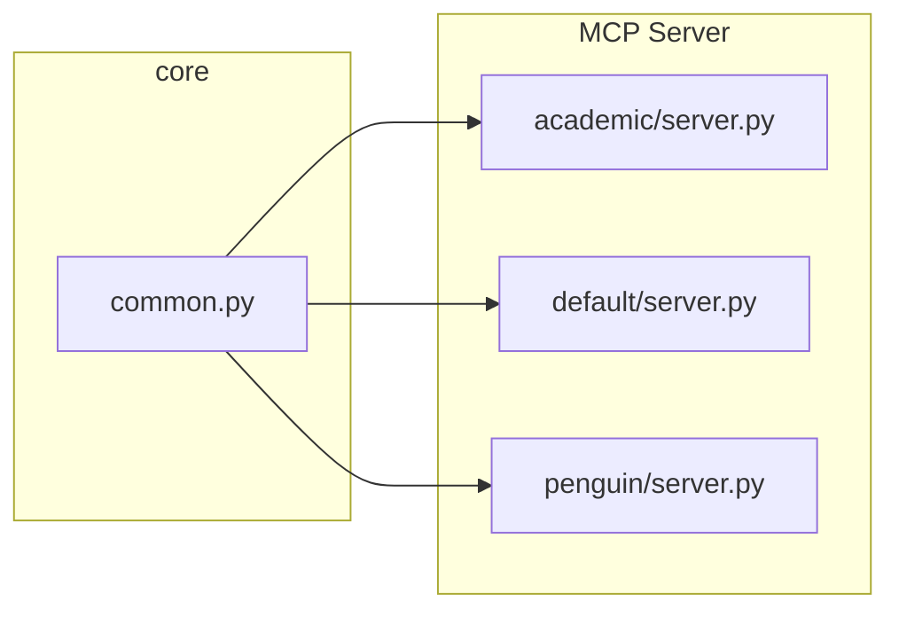

## 创建新的 theme 的方法

```bash
cd servers/themes
cp -r default new_theme
cd new_theme
```

然后修改 `manifest.json` 文件，修改下面几个字段：

- name：theme 的名称
- github：theme 的 github 地址
- images：theme 的轮播图地址
- installScripts：主题的安装脚本

运行下面的 prompt 来快速更新 `prompts/syntax/slidev_layouts.j2` 这个 prompt，它将用于指导大模型如何使用使用新的主题：

```md
请理解 slidev 的基础布局：

<layout id="center"> ... </layout> 代表 center 这个布局的介绍和用法。

<layouts>
    <layout id="center">
        <description>将内容显示在屏幕中央。</description>
    </layout>
    
    <layout id="cover">
        <description>用于展示演示文稿封面页，可包含演示标题、背景信息等。</description>
    </layout>
    
    <layout id="default">
        <description>最基础的布局，可展示任意类型内容。</description>
    </layout>
    
    <layout id="end">
        <description>演示文稿的结束页面。</description>
    </layout>
    
    <layout id="fact">
        <description>以突出方式展示事实或数据。</description>
    </layout>
    
    <layout id="full">
        <description>使用全屏幕空间展示内容。</description>
    </layout>
    
    <layout id="image-left">
        <description>在屏幕左侧显示图像，内容将置于右侧。</description>
        <usage>
            <code>
---
layout: image-left

# 图像源
image: /path/to/the/image

# 内容区域的自定义类名
class: my-cool-content-on-the-right
---
            </code>
        </usage>
    </layout>
    
    <layout id="image-right">
        <description>在屏幕右侧显示图像，内容将置于左侧。</description>
        <usage>
            <code>
---
layout: image-right

# 图像源
image: /path/to/the/image

# 内容区域的自定义类名
class: my-cool-content-on-the-left
---
            </code>
        </usage>
    </layout>
    
    <layout id="image">
        <description>将图像作为页面主内容展示。</description>
        <usage>
            <code>
---
layout: image

# 图像源
image: /path/to/the/image
---
可通过 backgroundSize 属性修改默认背景尺寸（cover）：

---
layout: image
image: /path/to/the/image
backgroundSize: contain
---

---
layout: image-left
image: /path/to/the/image
backgroundSize: 20em 70%
---
            </code>
        </usage>
    </layout>
    
    <layout id="iframe-left">
        <description>在屏幕左侧显示网页，内容将置于右侧。</description>
        <usage>
            <code>
---
layout: iframe-left

# 网页源地址
url: https://github.com/slidevjs/slidev

# 内容区域的自定义类名
class: my-cool-content-on-the-right
---
            </code>
        </usage>
    </layout>
    
    <layout id="iframe-right">
        <description>在屏幕右侧显示网页，内容将置于左侧。</description>
        <usage>
            <code>
---
layout: iframe-right

# 网页源地址
url: https://github.com/slidevjs/slidev

# 内容区域的自定义类名
class: my-cool-content-on-the-left
---
            </code>
        </usage>
    </layout>
    
    <layout id="iframe">
        <description>将网页作为页面主内容展示。</description>
        <usage>
            <code>
---
layout: iframe

# 网页源地址
url: https://github.com/slidevjs/slidev
---
            </code>
        </usage>
    </layout>
    
    <layout id="two-cols">
        <description>将页面内容分为两栏。</description>
        <usage>
            <code>
---
layout: two-cols
---

# 左侧

此处内容显示在左侧

::right::

# 右侧

此处内容显示在右侧
            </code>
        </usage>
    </layout>
    
    <layout id="two-cols-header">
        <description>将页面内容分为上下两行，第二行再分割为左右两栏。</description>
        <usage>
            <code>
---
layout: two-cols-header
---

跨栏内容

::left::

# 左侧

此处内容显示在左侧

::right::

# 右侧

此处内容显示在右侧
            </code>
        </usage>
    </layout>
</layouts>
```

等待大模型回复完成后，将新主题的 README 直接扔进去。

将生成的 xml 选择性加入 `prompts/syntax/slidev_layouts.j2`。

使用 openmcp 来快速完成测试，并打开 slidev 进行效果预览。

导入 prompt 顺序：

`usermcp_guide_prompt` 无参数

`slidev_generate_with_specific_outlines` 装填参数为

```yaml
title:
I18n haru 介绍

content:
:sum https://document.kirigaya.cn/docs/i18n-haru/introduction.html
我最近在调研 i18n haru 相关的技术，下面是基本的用法
https://document.kirigaya.cn/docs/i18n-haru/introduction.message.html

outline:
{
    "param": {
        "outlines": [
        {
            "group": "介绍部分",
            "content": "# i18n-haru 介绍\n- 现代化国际化解决方案\n- 基于解耦合思想的 i18n 框架\n- 专为高效开发设计的插件系统"
        },
        {
            "group": "i18n 基础概念",
            "content": "## 什么是 i18n？\n- Internationalization（国际化）的缩写\n- 软件适应不同语言、地区和文化的过程\n- 目标：无需代码修改即可支持多语言\n- 示例：软件界面语言切换功能"
        },
        {
            "group": "为什么需要 i18n",
            "content": "## 为什么需要 i18n？\n- 欧洲互联网发展的历史教训\n- 语言多样性对软件推广的影响\n- 跨国软件开发的必要组件\n- 大模型时代翻译问题的完美解决"
        },
        {
            "group": "i18n 实现原理",
            "content": "## i18n 实现原理\n- 核心思想：解耦合（decouple）\n- 传统方式：widget.set_text(\"具体文本\")\n- i18n 方式：widget.set_text(t(\"message.key\"))\n- 好处：翻译与代码分离，专业翻译人员可参与"
        },
        {
            "group": "i18n 组成部分",
            "content": "## i18n 的三大部分\n1. **i18n 框架**：提供 t 函数、配置文件读取、语言切换\n2. **i18n 配置文件**：JSON/YAML 格式的翻译文本\n3. **i18n 插件**：弥补解耦合带来的开发难点"
        },
        {
            "group": "t 函数详解",
            "content": "## t 函数的函数签名\n- 跨语言统一的函数签名：t(message: string): string\n- 示例：t(\"i18n.introduction\")\n- 根据当前语言环境返回对应翻译\n- 找不到翻译时返回原始 key 或默认语言"
        },
        {
            "group": "参数支持",
            "content": "## 参数支持类型\n- **无名参数**：{0}, {1}, {2}...\n- **具名参数**：{name}, {age}, {title}...\n- 动态内容填充，支持复杂场景\n- 代码示例展示两种参数用法"
        },
        {
            "group": "配置文件规范",
            "content": "## i18n 配置文件规范\n- **文件命名**：bundle.{iso639}.json\n- **内容格式**：JSON/YAML 键值对\n- **key 命名规范**：level.module.name.component\n- 示例：info.vcd-view.load.button"
        },
        {
            "group": "message key 命名规范",
            "content": "## message key 命名规范详解\n- **格式**：<level>.<module>.<name>.<component>\n- **level**：通知等级（info, warning, error）\n- **module**：功能模块名称\n- **name**：功能描述\n- **component**：具体组件（button, title, text）"
        },
        {
            "group": "i18n-haru 优势",
            "content": "## i18n-haru 的独特优势\n- **高效开发**：减少解耦合带来的额外工作量\n- **智能提示**：支持参数名的代码提示\n- **大模型集成**：AI 辅助翻译加速开发\n- **完整工具链**：从配置到部署的完整解决方案"
        },
        {
            "group": "实际应用场景",
            "content": "## 实际应用场景\n- **Web 应用**：Vue/React 项目国际化\n- **桌面软件**：跨平台应用多语言支持\n- **移动应用**：iOS/Android 国际化\n- **游戏开发**：多语言游戏内容管理"
        },
        {
            "group": "最佳实践",
            "content": "## i18n 开发最佳实践\n- **早期规划**：项目初期就考虑国际化\n- **团队协作**：开发、翻译、测试分工明确\n- **自动化工具**：利用 AI 和大模型加速翻译\n- **持续迭代**：根据用户反馈优化翻译质量"
        },
        {
            "group": "总结与展望",
            "content": "## 总结与展望\n- i18n 是现代软件开发的必备能力\n- i18n-haru 提供了完整的解决方案\n- 大模型时代，国际化门槛大幅降低\n- 未来：AI 驱动的智能国际化工具"
        }
        ]
    }
}


path:
i18n-haru
```