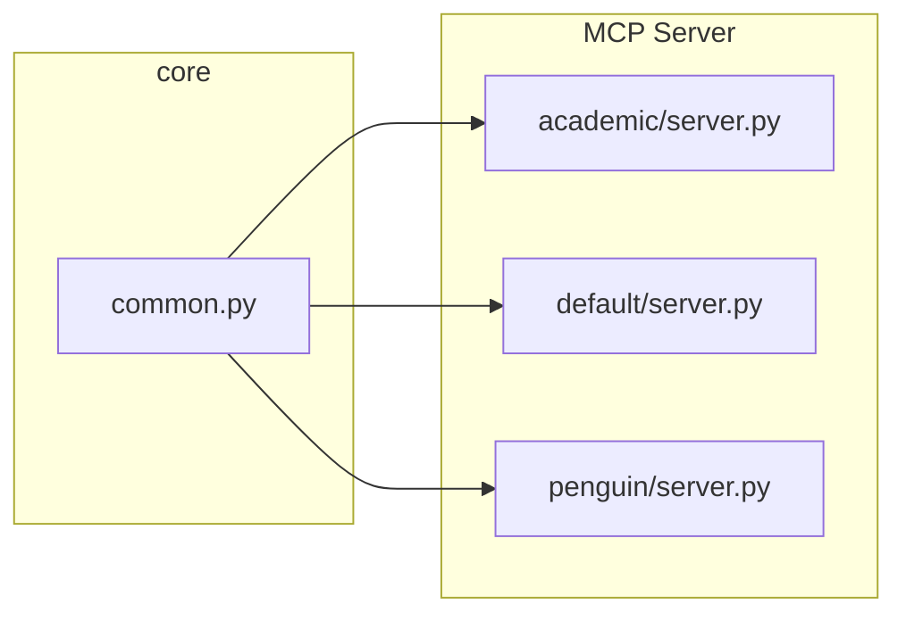

```mermaid
flowchart LR
    subgraph core[core]
        A[common.py]
    end

    subgraph themes[MCP Server]
        T1[academic/server.py]
        T2[default/server.py]
        T3[penguin/server.py ]
    end

    A --> T1

    A --> T2
    A --> T3
```